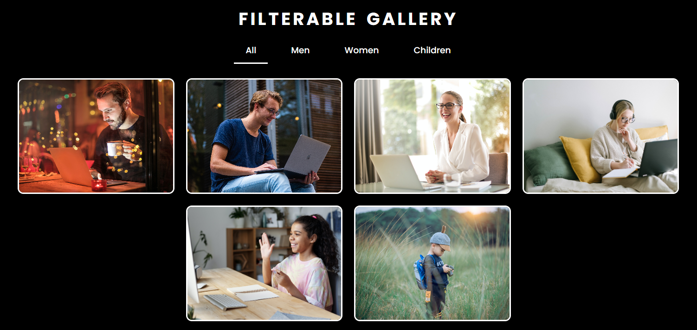

# Responsive Image Gallery with Filter Functionality

This project is a simple **Filterable Image Gallery** where users can search for images by selecting the category of the image or clicking on a menu. The gallery filters and displays images based on the selected menu. It uses **HTML**, **CSS**, and **JavaScript** to build an interactive and responsive web page.

## Features

- **Responsive Design**: The gallery layout adjusts according to the screen size, making it mobile-friendly.
- **Filter Functionality**: Users can filter images based on their names by selecting on bar.
- **Real-Time Filtering**: As the user types in the input box, the images are dynamically filtered.
- **Clear and Simple UI**: The gallery has a clean and minimal design.

## Project Structure

- **`index.html`**: The main HTML file that contains the structure of the image gallery and search box.
- **`style.css`**: The stylesheet for styling the page, including the gallery and search box.
- **`index.js`**: The JavaScript file that handles the search logic and interaction with the DOM.
- **`images/`**: A folder containing sample images used in the gallery (You can replace these with your own images).

## Demo

You can view a live demo of this project [here](https://sonumehtaskr.github.io/filterable-gallery).

## Screenshots

Here are a few screenshots of the image gallery:

## Technologies Used

- **HTML**: For building the structure of the webpage.
- **CSS**: For styling the webpage and making it responsive.
- **JavaScript**: For handling the filter functionality and DOM interactions.